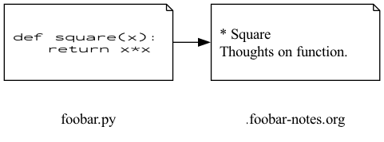

#+TITLE: Taking Notes with Org
#+AUTHOR: Howard X. Abrams
#+DATE:   2026-07-14
#+FILETAGS: emacs hamacs
#+LASTMOD: [2026-07-14 Tue]
#+PROPERTY: foo baz

A literate programming file for configuring Emacs to take notes.

#+begin_src emacs-lisp :exports none
  ;;; ha-code-notes --- configuring Emacs to take notes. -*- lexical-binding: t; -*-
  ;;
  ;; © 2026 Howard X. Abrams
  ;;   Licensed under a Creative Commons Attribution 4.0 International License.
  ;;   See http://creativecommons.org/licenses/by/4.0/
  ;;
  ;; Author: Howard X. Abrams <http://gitlab.com/howardabrams>
  ;; Maintainer: Howard X. Abrams
  ;; Created: July 14, 2026
  ;;
  ;; While obvious, GNU Emacs does not include this file or project.
  ;;
  ;; *NB:* Do not edit this file. Instead, edit the original literate file at:
  ;;            /Users/howard.abrams/src/hamacs/ha-code-notes.org
  ;;       And tangle the file to recreate this one.
  ;;
  ;;; Code:
#+end_src

* Introduction
Seems silly to have a full set of instructions for /taking notes/ using Org-mode, because that is what it does, but this is a bit special.

When I [[file:ha-capturing-notes.org][capture notes]] with a link to some source code, the /destination/ is a *clocked in* task. Useful, but seems to require a dedicated task and some forethought. The following project pairs a “source code file” (which can be any file, actually) and a “notes file” with headers based on the function in the original file.

#+begin_src dot :file ha-code-notes-illustration.png :results file :exports results
  digraph G {
    rankdir=LR;
    // Make to icons side-by-side
    code_file [shape=note, label="", fixedsize=true, width=1, height=1.5];
    note_file [shape=note, label="", fixedsize=true, width=1, height=1.5];

    // Create a couple of label to live _below_ the icons:
    code_label [shape=plaintext, label="foobar.py"];
    note_label [shape=plaintext, label=".foobar-notes.org"];
    { rank=same; code_file; code_label; }
    { rank=same; note_file; note_label; }
    code_file -> code_label [style=invis];
    note_file -> note_label [style=invis];

    // Connect the code and note icons:
    code_file -> note_file;
  }
#+end_src

#+attr_org: :width 800px

This allows me to /wax poetic/ with a parallel, but separate org file. Of course, this requires adding the following to /every project’s =.gitignore= file/ (or in your =HOME= directory).

#+BEGIN_EXAMPLE
/.*-notes.org
#+END_EXAMPLE

If this isn’t good for you, check out [[https://github.com/agoodman42/montag][Montag]]. Same project, different approach using a single directory for all notes with [[https://www.orgroam.com/][org-roam]].

Another feature when looking at the notes in the org buffer, is to hit the same key to return to the source code file referencing the notes.

# TODO Create custom settings to override default behavior.
* Helper Functions
While this project started simple, I’ve expanded the ideas, and this requires some custom helper functions.
** Relative Code Locations
Creating a note based on the filename, should be easy, but what if I made the header’s in this file reference a location in the original source code. For instance:

#+begin_example
foo.py               .foo-notes.org
------               ------------------

def square(x):   →   * Square
  return x*x         Notes about the function
#+end_example

We /could/ store the line number as an Org Property of the =foobar= header, but this would get out of sync as the =foo.py= source code changed.

What we want is to store the /function name/ as an Org Property, and some sort of offset from the function name. For instance:

#+begin_example
  foo.py                          .foo-notes.org
  ------                          ------------------

  def square(x):              →   * Square
    "Return the square of x."     :PROPERTIES:
    return x*x                    :XREF_NAME: square
                                  :XREF_OFFSET: 2
                                  :END:
                                  Notes about the function
#+end_example

My immediate thought was to tie into the =xref= module for Emacs, but it doesn’t have a query function about what function or class/method the point is in. The following functions take advantage of =which-function= and =imenu= to programmatically give me /relative location/ and a =-goto= to return to that location.

This was far gnarlier than I originally thought, since IMenu only wants to /interactively/ walk down a tree, specifically the top-level class, then the methods inside that class, and even to the parameters of the method.

#+BEGIN_SRC emacs-lisp
  (defun ha-code-notes-location ()
    "Return point location relative from its nearest enclosing definition.
  Can use later, even if intervening lines shift.

  Returns a list for `ha-code-location-goto' to use, suitable for
  `seq-let':

    (file qualified-name offset)"
    (let* ((here  (point))
           (entry (thread-last (imenu--make-index-alist t)
                               ;; Flatten hierarchy labels with dot separators:
                               (ha-code-notes-location--flatten-index)
                               ;; Filter to only entries that occur after point:
                               (seq-filter (lambda (e) (<= (cdr e) here)))
                               ;; Sort the remaining entries by position
                               ;; (since out flatten-index function
                               ;; doesn't guarantee the order):
                               (seq-sort-by #'cdr #'>)
                               ;; And the first entry on the list is our goal:
                               car)))
      (unless entry
        (error "No enclosing definition found for point"))
      (list (buffer-file-name)
            (car entry)
            (- (line-number-at-pos here) (line-number-at-pos (cdr entry))))))
#+END_SRC

The needed /trick/ is to flatten this IMenu hierarchy using this recursive beauty:

#+BEGIN_SRC emacs-lisp
  (defun ha-code-notes-location--flatten-index (alist &optional prefix)
    "Flatten imenu ALIST into a list of (QUALIFIED-NAME . POSITION).
  Where the qualified-name matches what which-function/imenu expect.

  For instance:

     (((\"foo_class\") (\"method_one\") (\"method_two\") ...) ...)

  To:

     ((\"foo_class.method_one\" ...) (\"foo_class.method_two\" ...)...)

  This is called recursively, so PREFIX could be a class name, or
  other higher abstraction."
    ;; Like `mapconcat' but lets us concat into something other than a string.
    ;; Note that `mapcan' uses `nconc' which _mutates_ the `alist'.
    ;; This is fine as a parameter that we then return:
    (mapcan
     (lambda (entry)
       ;; Some imenu backends (e.g. python.el) annotate names with their
       ;; category, e.g. "Pair (class)" or "sum (def)". Strip that so
       ;; names match what `which-function'/`add-log-current-defun'
       ;; produce, and what gets stored as XREF_NAME in notes files.
       (let* ((name (replace-regexp-in-string
                     (rx space "(" (one-or-more alpha) ")" string-end)
                     "" (car entry)))
              (value (cdr entry))
              (qualified (if prefix (format "%s.%s" prefix name) name)))
         (if (listp value)
             (ha-code-notes-location--flatten-index value qualified)
           (list (cons qualified (if (markerp value) (marker-position value) value))))))
     alist))
#+END_SRC

Once inside a source file, we can jump to one of these /relative locations/:

#+BEGIN_SRC emacs-lisp
  (defun ha-code-notes-location-goto (file name offset)
    "Move point to the position described by relative location.

  FILE is the filename to load, may be nil to use current buffer.
  NAME is a function name or other definition, e.g. ClassName.method
  OFFSET is the number of lines below NAME to position the point."
    (when (and file (not (equal file (buffer-file-name))))
      (find-file-other-window file))

    (let* ((index (ha-code-notes-location--flatten-index (imenu--make-index-alist t)))
           (entry (assoc name index)))
      (if (not entry)
          (message "Definition `%s' no longer found in %s" name file)
        (goto-char (cdr entry))
        (when offset
          (forward-line offset)))))
#+END_SRC

To verify that this works:

#+BEGIN_SRC emacs-lisp
  (seq-let (file heading offset) (ha-code-notes-location)
    (ha-code-notes-location-goto file heading offset))
#+END_SRC

The cool part of these functions is that this works in Org and Markdown files too!
** Org Properties
The =org-set-property= will set a key/value pair in the ~:PROPERTIES:~ section of the /current section/, but I want to add a buffer-level /property/ to an org-mode file, for instance:

#+begin_example
  ,#+TITLE: The title of the file
  ,#+PROPERTY: key1 value1
#+end_example

The tricky bit about this function is that if (in the above example) =key1= exists, we should /replace/ it, not add to it.

#+BEGIN_SRC emacs-lisp
  (defun org-set-buffer-property (key value)
    "Set a buffer-level property at the top of an Org file.
  If KEY already refers to a #+PROPERTY, replace it.
  Otherwise, insert it at the end of the Org header lines."
    (let ((property-line (format "#+PROPERTY: %s %s" key value))
          (magic-re (rx  (group line-start "#+PROPERTY:"
                                    (one-or-more space) (literal key) (one-or-more space)
                                    (zero-or-more any)
                                    line-end))))
      (save-excursion
        (goto-char (point-min))
        (while (cond
                ((looking-at magic-re) (replace-match property-line t t))
                ((looking-at "#")      (forward-line))
                (t                     (insert property-line ?\n)))))))
#+END_SRC

Note: The =while= loop above has no body, as the =cond= is the predicate as it returns non-nil if it has more to process. This works because =replace-match= and =insert= return =nil=, while =forward-line= returns a non-nil value.

The function, =org-entry-get=, returns the value of a property /of the current heading/, and will walk up to parent sections too when passed a non-nil INHERIT argument. That handles everything except the buffer-level default set via =#+PROPERTY:=, which isn't attached to any heading, so we need a fallback for that case.

And we need the ability to read it. The Org API doesn’t have a function to read it without parsing the entire structure, so we use the =org-collect-keywords= for the =PROPERTY= value, and then parse the results.

#+BEGIN_SRC emacs-lisp
  (defun org-get-property (property)
    "Return the value of the Org PROPERTY.
  Works even if the property is set in a parent section.
  Return nil if the property is not found."

    (defun org-get-buffer-property (property)
      "Helper function that reads the current PROPERTY set in the buffer."
      (when-let* ((properties (thread-last "PROPERTY"
                                           (list)  ; Requires a list of keywords
                                           (org-collect-keywords)
                                           (car)   ; A list of lists? Get first entry
                                           (cdr))) ; Remove the `PROPERTY' element

                  ;; See if property matches the key in a "key value" pair:
                  (find-property-p (lambda (kv) (string= property (car (split-string kv)))))

                  ;; Each entry in properties is a string with the key and value:
                  (entry (seq-find find-property-p properties)))
        (substring entry (1+ (string-search " " entry)))))

    ;; Check the entry at point (and its ancestors) first; only look
    ;; for a buffer-level default if neither has it set:
    (or (org-entry-get nil property t)
        (org-get-buffer-property property)))
#+END_SRC

These two work like:

#+BEGIN_SRC emacs-lisp :tangle no
  (org-set-buffer-property "foo" "bar")
  (org-get-property "foo")  ; ⟹ "bar"

  ;; Reset the value:
  (org-set-buffer-property "foo" "baz")
  (org-get-property "foo")  ; ⟹ "baz"

  ;; Over shadow the global property with local one:
  (org-set-property "foo" "boo")
  (org-get-property "foo")  ; ⟹ "boo"

  ;; And remove it:
  (org-delete-property "foo")
  (org-get-property "foo")  ; ⟹ "baz"
#+END_SRC

* Write a Note
This function defines what the notes filename should look like, loads it in a side window, and adds a /back reference/ in the form of an org-mode =property=. Next it needs to either find the section that matches the function in the code we are writing about, or jumps to the bottom and creates it.

#+BEGIN_SRC emacs-lisp
  (require 'which-func)

  (defun ha-code-notes ()
    "Open an Org file based on the current opened file.
  The pattern for choosing the name of the org file is:

     foobar.py --> .foobar-notes.org

  The Org header will be the name of the function in the original source
  code file. This means you have one note section per function, which
  should be fine in practice because functions are small and succinct,
  right?"
    (interactive)
    (let* ((orig-file   (buffer-file-name))
           (orig-parent (file-name-directory orig-file))
           (orig-base   (file-name-base orig-file))

           ;; Keep in mind the `orig-parent' has a final slash, so the
           ;; initial . here marks it as hidden:
           (note-file   (format "%s.%s-notes.org"
                                orig-parent orig-base))
           (header      (which-function))
           (offset      (ha-code-notes-defun-rel-line)))

      ;; With the above local variables defined, we can open the file in
      ;; a window (pane) to the side:
      (find-file-other-window note-file)
      (org-set-buffer-property "XREF" orig-file)

      ;; Create a new section in the notes file:
      (ha-code-notes-insert-heading header offset)

      ;; (when-let ((buf (find-buffer-visiting orig-file)))
      ;;   (with-current-buffer buf
      ;;     (ha-code-notes--fringe)))
      ))
#+END_SRC

Use the builtin autoinsert feature to inject a basic template at the beginning of the notes file when we first create the notes file:

#+BEGIN_SRC emacs-lisp
    (use-package autoinsert
      :config
      (define-auto-insert
        (cons (rx "/." (one-or-more (not "/")) "-notes.org" string-end) "Org Notes Template")
         '("Short description: "
           "#+TITLE: "
           (s-titleized-words (s-replace-regexp (rx (any "-" "_")) " "
                                               (file-name-base (buffer-file-name))))
           \n
           "#+DATE:"   (format-time-string "%Y-%m-%d %a")
           \n
           "#+LASTMOD:" (format-time-string "[%Y-%m-%d %a]")
           \n \n)))
#+END_SRC

What is the offset?

#+BEGIN_SRC emacs-lisp
  (defun ha-code-notes-defun-rel-line ()
    "Return the number of lines between point and the start of the current defun."
    (let ((orig-line (line-number-at-pos)))
      (save-excursion
        (if (provided-mode-derived-p major-mode '(text-mode))
            (org-previous-visible-heading 1)
          (beginning-of-defun))
        (- orig-line (line-number-at-pos)))))
#+END_SRC

If a heading matching the function already exists, we add a new subheading under it to record this particular visit. The real purpose of this, is to store a relative line number to another section of the function. Its title is left blank, so we hand off to the user to name it, then jump to the body once they press RET or TAB:

#+BEGIN_SRC emacs-lisp
  (defun ha-code-notes-insert-heading (header offset)
    "Insert heading recording OFFSET under heading matching HEADER.

    Finds the top-level Org heading whose `XREF_NAME' property equals
    HEADER. If none exists, inserts one at the end of the buffer.
    Otherwise, looks inside that heading's subtree for an entry whose
    `XREF_LINE' property already equals OFFSET: if found, this visit
    was already recorded, so we jump to its body instead of inserting
    a duplicate. Otherwise, inserts a new level-2 subheading at the
    end of the section.

    Before inserting a new subheading, it will prompt for the value."
    (goto-char (point-min))
    (let ((top-level (org-find-property "XREF_NAME" header)))
      (if (not top-level)
          ;; No section for this function yet: create one at the end.
          (progn
            (goto-char (point-max))
            (ha-code-notes--insert-heading header offset 1))

        ;; Found the function's section; look inside it for this
        ;; exact visit before deciding to insert a new subheading.
        (goto-char top-level)
        (let ((visit (save-excursion
                       (save-restriction
                         (org-narrow-to-subtree)
                         (org-find-property "XREF_LINE" (number-to-string offset))))))
          (if visit
              (progn (goto-char visit) (org-end-of-subtree))
            (ha-code-notes--insert-heading "" offset 2))))))
#+END_SRC

The above function require this helper function to insert the initial text of the section and its header:

#+BEGIN_SRC emacs-lisp
  (defun ha-code-notes--insert-heading (header offset level)
    "Insert a section with headline, HEADER."
    (when-let ((section-label (read-string "Section header: " header)))
      ;; Make sure our new heading is at the end of current section:
      (org-insert-heading '(4) nil level)
      (insert (format "%s" section-label))

      (org-insert-property-drawer)
      ;; In case we want to change the section header name, we store
      ;; the name of the function that led us here as a property:
      (when (= level 1)
        (org-set-property "XREF_NAME" header))
      (org-set-property "XREF_LINE" (number-to-string offset))
      (org-end-of-subtree)))
#+END_SRC

** Return to Source Code
If we are /inside/ one of these note files, let’s have a quick way to return back to the original “code” file:

#+BEGIN_SRC emacs-lisp
  (defun ha-code-notes-return ()
    "Return to the code referenced in the notes.
  Essentially pretends we have a backlink without a database. Reads
  XREF_LINE and XREF_NAME off the entry containing point, rather than
  just the first match anywhere in the buffer, so returning from a
  subheading lands on the line for that particular visit."
    (interactive)
    (let* ((filename (org-get-property "XREF"))
           (f-offset (when-let ((line (org-entry-get nil "XREF_LINE")))
                       (string-to-number line)))
           (function (or (org-entry-get nil "XREF_NAME" t) (which-function))))

      ;; If the property is set, load that file (which jumps to the
      ;; buffer if it is displayed), otherwise, we assume the previous
      ;; buffer contains it:
      (if filename
          (find-file-other-window filename)
        (switch-to-prev-buffer))

     (ha-code-notes-location-goto filename function f-offset)))
#+END_SRC

And give us keybinding that will either go to the notes (if we are in some code) or return to the source code (if we are in our notes):

#+BEGIN_SRC emacs-lisp
  (defun ha-code-notes-dwim ()
    "Open the notes buffer, or return to the code."
    (interactive)
    (when (buffer-file-name)
      (if (string-match (rx "/." ; A hidden file
                            (one-or-more (not "/"))
                            "-notes.org" string-end)
                        (buffer-file-name))
          (ha-code-notes-return)
        (ha-code-notes))))

  (ha-leader "n c" '("code notes" . ha-code-notes-dwim))
#+END_SRC

** Fringe Indicators for Notes

A code file with an associated notes file is easy to forget about. Let's mark, in the fringe, every line that has a note, so we notice it as we scroll past:

#+BEGIN_SRC emacs-lisp
  (define-fringe-bitmap 'ha-code-notes-bitmap
    [#b00001100
     #b00010110
     #b00010111
     #b00101110
     #b00101110
     #b01011100
     #b01011100
     #b10110000
     #b10010000
     #b11100000]
    nil nil 'center)

  (defface ha-code-notes-face
    '((t :foreground "yellow"))
    "Face for the fringe marker indicating a line has an associated note.")

  (defvar-local ha-code-notes--fringe-overlays nil
    "Overlays marking lines in this buffer that have notes in the paired notes file.")

  (defun ha-code-notes--fringe ()
    "Mark, in the fringe, every line in this buffer that has a note.
  Notes live in the paired `.BASE-notes.org' file (see
  `ha-code-notes') as headings whose XREF property matches this
  file, XREF_NAME names the function (inherited by subheadings from
  their parent), and XREF_LINE is a line offset from that function's
  start, computed by `ha-code-notes-defun-rel-line'. We resolve each
  pair back to an absolute line via `ha-code-notes-location-goto', since the function
  may have moved since the note was taken."
    (mapc #'delete-overlay ha-code-notes--fringe-overlays)
    (setq ha-code-notes--fringe-overlays nil)
    (let* ((orig-file (buffer-file-name))
           (note-file (and orig-file
                           (format "%s.%s-notes.org"
                                   (file-name-directory orig-file)
                                   (file-name-base orig-file))))
           notes)
      (when (and note-file (file-exists-p note-file))
        (with-temp-buffer
          (insert-file-contents note-file)
          (org-mode)
          (org-map-entries
           (lambda ()
             (when (equal (org-get-property "XREF") orig-file)
               (when-let ((line (org-entry-get nil "XREF_LINE")))
                 (push (cons (org-entry-get nil "XREF_NAME" t)
                             (string-to-number line))
                       notes))))))
        (dolist (note notes)
          (save-excursion
            (ha-code-notes-location-goto nil (car note) (cdr note))
            (let ((ov (make-overlay (point) (point))))
              (overlay-put ov 'before-string
                           (propertize "x" 'display
                                       '(left-fringe ha-code-notes-bitmap
                                                     ha-code-notes-face)))
              (push ov ha-code-notes--fringe-overlays)))))))

  (add-hook 'find-file-hook #'ha-code-notes--fringe)
#+END_SRC

New notes and edited notes should refresh the markers too, so we hook into saving a notes file, and refresh right after inserting a new XREF property drawer:

#+BEGIN_SRC emacs-lisp
  (defun ha-code-notes--fringe-notes-refresh-all ()
    "Refresh fringe note markers in every buffer after saving a notes file."
    (when (string-match (rx "-notes.org" string-end) (buffer-file-name))
      (dolist (buf (buffer-list))
        (with-current-buffer buf
          (when buffer-file-name
            (ha-code-notes--fringe))))))

  (add-hook 'after-save-hook #'ha-code-notes--fringe-notes-refresh-all)
#+END_SRC

* Technical Artifacts                                :noexport:

Let's =provide= a name so we can =require= this file:

#+begin_src emacs-lisp :exports none
  (provide 'ha-code-notes)
  ;;; ha-code-notes.el ends here
#+end_src

#+DESCRIPTION: configuring Emacs to take notes.

#+PROPERTY:    header-args:sh :tangle no
#+PROPERTY:    header-args:emacs-lisp  :tangle yes
#+PROPERTY:    header-args    :results none :eval no-export :comments no mkdirp yes

#+OPTIONS:     num:nil toc:nil todo:nil tasks:nil tags:nil date:nil
#+OPTIONS:     skip:nil author:nil email:nil creator:nil timestamp:nil
#+INFOJS_OPT:  view:nil toc:nil ltoc:t mouse:underline buttons:0 path:http://orgmode.org/org-info.js
